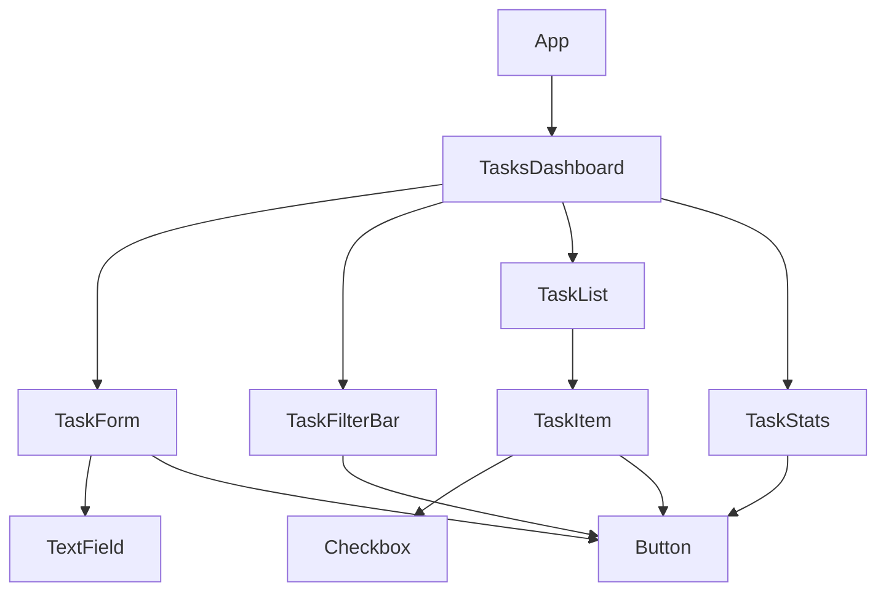
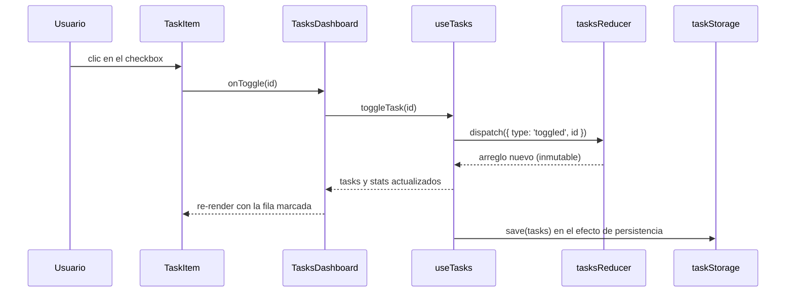

# Arquitectura

## 1. Contexto y objetivo

Dashboard de Tareas: un CRUD mínimo (crear, completar, eliminar, filtrar,
limpiar completadas) con persistencia local. Es material didáctico para una
charla de Fundamentos de Ingeniería de Software, no un producto. La prioridad
es que cada decisión sea explicable en voz alta y visible en el código.

### Límites del sistema

Dentro: gestión de tareas en memoria del navegador, persistencia en
`localStorage`, sincronización entre pestañas de la misma máquina.

Fuera: autenticación, backend o API, múltiples usuarios, routing, prioridades
o fechas de vencimiento, internacionalización, edición en línea del título.
La sección 7 explica cómo se añadiría cada cosa.

## 2. Estilo arquitectónico

- Interfaz basada en componentes con flujo de datos unidireccional (top down):
  los datos bajan por props y los eventos suben por callbacks.
- Dentro de la característica `tasks`, cuatro capas con dependencia en un solo
  sentido:

```
presentación  -->  lógica de estado  -->  modelo puro
                         |                     ^
                         v                     |
                      servicios  ------------->+

Una flecha "A --> B" significa que A depende de B (lo importa).
- presentación: components/ y features/tasks/components/ (solo pintan, reciben props)
- lógica de estado: features/tasks/hooks/useTasks.ts (useReducer, useMemo, efectos; sin reglas de negocio)
- modelo puro: features/tasks/model/ (task, tasksReducer, taskFilters, taskCounts); funciones puras, sin React
- servicios: features/tasks/services/taskStorage.ts (persistencia tras una interfaz); usa isTask y Task del modelo
```

- Regla de dependencias: el modelo puro no importa React; el hook es el único
  módulo con efectos; ningún componente de presentación importa `useTasks`
  ni `taskStorage`.

## 3. Vistas

### 3.1 Jerarquía de componentes



### 3.2 Recorrido de un evento (marcar una tarea como completada)



## 4. Atributos de calidad

| Atributo                 | Decisión que lo sostiene                                                                                                                  |
| ------------------------ | ----------------------------------------------------------------------------------------------------------------------------------------- |
| Mantenibilidad           | Archivos pequeños con una sola responsabilidad; reglas de negocio en funciones puras aisladas                                             |
| Testeabilidad            | Reducer y filtros puros se prueban sin DOM; el hook recibe el almacenamiento por parámetro y en pruebas se inyecta una versión en memoria |
| Escalabilidad del código | Estructura feature-based: una funcionalidad nueva es una carpeta nueva, no ediciones dispersas                                            |
| Legibilidad              | Convenciones fijadas por ESLint y Prettier; nombres en inglés; comentarios de anclaje solo donde aportan                                  |
| Trazabilidad de errores  | Flujo unidireccional: un cambio de estado siempre pasa por una acción del reducer, fácil de registrar y depurar                           |

## 5. Cohesión y acoplamiento

- Cohesión alta: cada módulo hace una cosa. `tasksReducer` calcula estado,
  `taskFilters` filtra, `taskStorage` persiste, `useTasks` coordina.
- Acoplamiento bajo:
  - Props mínimas por componente (ISP). `TaskItem` recibe `task`, `onToggle`
    y `onRemove`, nada más.
  - El hook depende de la interfaz `TaskStorage`, no de `localStorage` (DIP).
  - Los filtros son un punto de extensión: agregar uno no obliga a tocar el
    código existente (OCP).
  - Los componentes de presentación no conocen el origen de los datos, así que
    se pueden reubicar o reutilizar sin arrastrar dependencias.

## 6. Decisiones de arquitectura (ADR ligero)

### ADR 1: estructura feature-based

- Contexto: la charla contrasta organizar por tipo de archivo frente a
  organizar por funcionalidad.
- Decisión: agrupar todo lo de tareas en `features/tasks/` (modelo, hook,
  servicios, componentes, pruebas).
- Alternativas: carpetas por tipo (`components/`, `hooks/`, `reducers/`).
- Consecuencias: menos saltos entre carpetas al trabajar una funcionalidad;
  menos conflictos entre personas; los primitivos verdaderamente compartidos
  quedan en `src/components/`.

### ADR 2: useReducer en vez de Redux u otra librería

- Contexto: hay que mostrar el estado como máquina de estados finitos.
- Decisión: `useReducer` con un reducer puro; sin dependencias de estado.
- Alternativas: Redux Toolkit, Zustand, Context con useState.
- Consecuencias: cero dependencias, el reducer se prueba como función pura;
  si la app creciera, el mismo reducer se puede mover a un store externo sin
  reescribir la lógica.

### ADR 3: sin Context para el estado de tareas

- Contexto: el mensaje de la charla es "flujo unidireccional y trazable".
- Decisión: elevar el estado a `TasksDashboard` y bajarlo por props.
- Alternativas: un `TasksProvider` con Context.
- Consecuencias: el flujo de datos es explícito y visible en el árbol; el
  árbol es lo bastante pequeño para que pasar props tres niveles no moleste.
  Si creciera, se introduciría Context en ese punto.

### ADR 4: adaptador de `localStorage` tras una interfaz

- Contexto: se quiere ilustrar DIP de forma concreta.
- Decisión: `TaskStorage` como interfaz, con implementación de `localStorage`
  y otra en memoria para pruebas.
- Alternativas: llamar `localStorage` directo dentro del hook.
- Consecuencias: el hook no depende del navegador; cambiar a una API REST es
  escribir otra implementación de `TaskStorage`, sin tocar el hook.

### ADR 5: CSS Modules

- Contexto: la charla no trata de estilos, pero el código debe verse ordenado.
- Decisión: un `.module.css` por componente, estilos mínimos.
- Alternativas: Tailwind, styled-components, CSS global.
- Consecuencias: alcance de estilos por componente sin dependencias; nada que
  explicar en la demo salvo el concepto de alcance local.

## 7. Evolución

- Estado global: si más pantallas necesitan las tareas, envolver
  `TasksDashboard` en un Context que exponga el resultado de `useTasks`. El
  reducer y los servicios no cambian.
- API real: nueva implementación de `TaskStorage` que hable con el backend;
  el hook pasa a manejar estados de carga y error. La interfaz ya existe.
- Routing: agregar React Router y mover `TasksDashboard` a una ruta; `App`
  pasa a ser el layout. Los componentes de la característica no cambian.
- Más operaciones (edición en línea, prioridades): nuevas acciones en el
  reducer y nuevos componentes de presentación; el patrón se mantiene.

## 8. Mapeo SOLID

| Principio | Dónde                                                                                                                                                                 |
| --------- | --------------------------------------------------------------------------------------------------------------------------------------------------------------------- |
| SRP       | `components/*` y `features/tasks/components/*` solo pintan; `useTasks` solo coordina; `tasksReducer` solo calcula; `taskStorage` solo persiste                        |
| OCP       | `taskFilters` como mapa de predicados; agregar un filtro no toca código existente                                                                                     |
| LSP       | Cualquier componente que respete el contrato de props de `Button` o `TaskItem` es intercambiable; las pruebas sustituyen callbacks por espías sin tocar el componente |
| ISP       | Cada componente declara solo las props que usa                                                                                                                        |
| DIP       | `useTasks` depende de `TaskStorage`; el valor por defecto es `localStorage`, las pruebas inyectan memoria                                                             |

## 9. Referencias

- `README.md`: cómo correr el proyecto, árbol de componentes, mapa charla a
  código y guion de demo en vivo.
